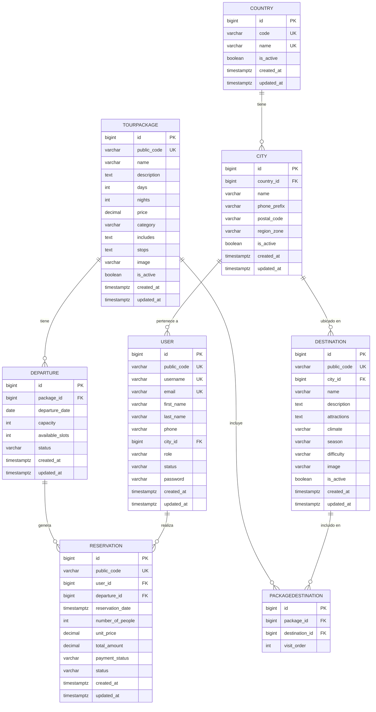

# Diagrama Entidad-Relación — TourPack Manager

```mermaid
erDiagram
    COUNTRY {
        bigint id PK
        varchar code UK
        varchar name UK
        boolean is_active
        timestamptz created_at
        timestamptz updated_at
    }

    CITY {
        bigint id PK
        bigint country_id FK
        varchar name
        varchar phone_prefix
        varchar postal_code
        varchar region_zone
        boolean is_active
        timestamptz created_at
        timestamptz updated_at
    }

    USER {
        bigint id PK
        varchar public_code UK
        varchar username UK
        varchar email UK
        varchar first_name
        varchar last_name
        varchar phone
        bigint city_id FK
        varchar role
        varchar status
        varchar password
        timestamptz created_at
        timestamptz updated_at
    }

    DESTINATION {
        bigint id PK
        varchar public_code UK
        bigint city_id FK
        varchar name
        text description
        text attractions
        varchar climate
        varchar season
        varchar difficulty
        varchar image
        boolean is_active
        timestamptz created_at
        timestamptz updated_at
    }

    TOURPACKAGE {
        bigint id PK
        varchar public_code UK
        varchar name
        text description
        int days
        int nights
        decimal price
        varchar category
        text includes
        text stops
        varchar image
        boolean is_active
        timestamptz created_at
        timestamptz updated_at
    }

    PACKAGEDESTINATION {
        bigint id PK
        bigint package_id FK
        bigint destination_id FK
        int visit_order
    }

    DEPARTURE {
        bigint id PK
        bigint package_id FK
        date departure_date
        int capacity
        int available_slots
        varchar status
        timestamptz created_at
        timestamptz updated_at
    }

    RESERVATION {
        bigint id PK
        varchar public_code UK
        bigint user_id FK
        bigint departure_id FK
        timestamptz reservation_date
        int number_of_people
        decimal unit_price
        decimal total_amount
        varchar payment_status
        varchar status
        timestamptz created_at
        timestamptz updated_at
    }

    COUNTRY ||--o{ CITY : "tiene"
    CITY ||--o{ USER : "pertenece a"
    CITY ||--o{ DESTINATION : "ubicado en"
    TOURPACKAGE ||--o{ PACKAGEDESTINATION : "incluye"
    DESTINATION ||--o{ PACKAGEDESTINATION : "incluido en"
    TOURPACKAGE ||--o{ DEPARTURE : "tiene"
    DEPARTURE ||--o{ RESERVATION : "genera"
    USER ||--o{ RESERVATION : "realiza"
```
